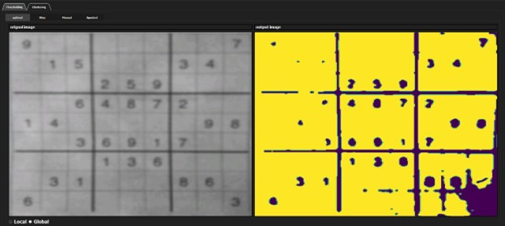
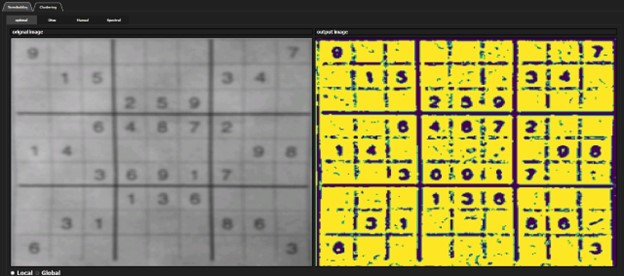
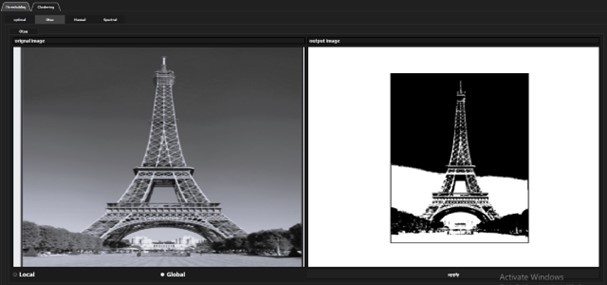
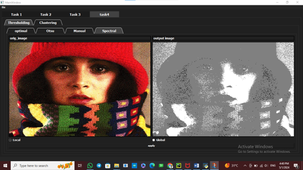
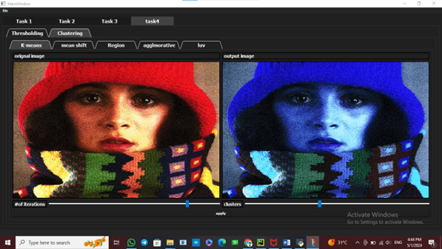
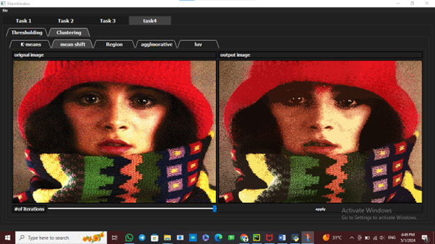
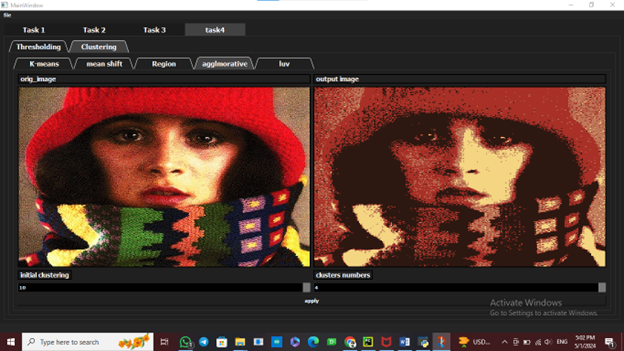

# Filtering and Edge Detection Techniques

---

## Additive Noise

This section involves the application of various types of noise to images, including Uniform, Gaussian, and Salt & Pepper noise. Each type of noise introduces different artifacts, simulating real-world image degradation.

## Low Pass Filters

Low pass filters are used to reduce noise and smooth images. The filters applied include the Average filter, Gaussian filter, and Median filter. These techniques are essential for preparing images for further analysis by reducing high-frequency noise.

## Edge Detection

Edge detection highlights the boundaries within an image by identifying significant changes in intensity. This task uses Sobel, Roberts, Prewitt, and Canny edge detectors to extract and visualize edges.

.png)
.png)
.png)

## Histogram Analysis

Histogram analysis provides insight into the distribution of pixel values in an image. This section covers histogram equalization, normalization, and thresholding, which are used to enhance contrast and segment images.

## Color Transformations

Color transformations convert color images into grayscale and allow for the plotting of R, G, and B histograms along with their distribution functions. These transformations help in analyzing images in different color spaces.

.png)
.png)
---

## Hybrid Images

Hybrid images are created by combining low and high-frequency components from different images, resulting in a composite image that shows different content when viewed from varying distances.
.png)

# Edge and Boundary Detection Techniques

## Line Detection

Line detection involves using the Hough transform to detect straight lines within an image. This process identifies the prominent lines and draws them on the original image.
.png)

---

## Circle Detection

Circle detection is performed by applying a modified Hough transform to detect circular shapes within an image. This method is particularly useful for identifying objects like coins, wheels, or any round objects.

.png)

---

## Ellipse Detection

Ellipse detection is a complex task due to the increased parameters in comparison to circles. Despite trying various algorithms, the built-in function `hough_ellipse` from scikit-image was used for this purpose.

.png)
.png)

---

## SNAKE Active Contour

The SNAKE model is an iterative algorithm that evolves a contour to fit the boundaries of an object within an image. It balances internal energy (smoothness of the contour) and external energy (fit to the image data).
.png)

# Feature Extraction and Image Matching Techniques

---

## Image Matching

This technique involves matching features between two images. We implemented two methods: Sum of Squared Differences (SSD) and Normalized Cross Correlations (NCC). These methods compare the descriptors of key points in both images to find matches.

.png)

---

## Scale-Invariant Feature Transform (SIFT)

SIFT is a robust algorithm for detecting and describing local features in images, making it ideal for tasks like image matching and object recognition. It is resilient to changes in scale, rotation, and illumination.

 Image Segmentation Techniques
.png)
.png)

---

## 1. Global Thresholding

Global thresholding is a simple image segmentation technique that converts an image into a binary image based on a global threshold value.

---

## 2. Local Thresholding

Local thresholding divides the image into smaller regions and applies different thresholds to each region, allowing for more flexibility in segmentation.

---

## 3. Otsu Thresholding

Otsu's method automatically determines an optimal threshold value by minimizing intra-class variance, making it useful for images with bimodal histograms.

---

## 4. Spectral Thresholding

Spectral thresholding segments an image by analyzing the intensity distribution and applying thresholds that optimize the separation between regions.

---

## 5. K-Means Segmentation

K-Means segmentation clusters image pixels into K clusters based on their color or intensity, effectively segmenting the image into distinct regions.

---

## 6. Mean Shift Segmentation

Mean shift segmentation is a non-parametric clustering method that identifies regions of high pixel density, effectively segmenting the image based on these regions.

---

## 7. Region Growing

Region growing starts with seed points and grows regions by adding neighboring pixels that are similar in intensity, effectively segmenting the image.

.png)
.png)

---

## 8. Agglomerative Segmentation

Agglomerative segmentation is a hierarchical clustering technique that merges similar regions to form a segmented image, starting with individual pixels.

---

# Face Detection and Recognition Techniques

---

## 1. Face Detection

Face detection is performed using a pre-trained Haar Cascade classifier (`haarcascade_frontalface_default.xml`). This method involves detecting faces in images by identifying features like eyes, nose, and mouth.

.png)

---

## 2. Face Recognition

Face recognition is achieved through a series of steps, including image preprocessing, mean normalization, and principal component analysis (PCA) to reduce dimensionality. The recognition process identifies the closest match by comparing the Euclidean distances between the test face and known faces.

---

## 3. ROC Curve Analysis

ROC (Receiver Operating Characteristic) curve analysis is used to evaluate the performance of the face recognition system. This involves plotting the True Positive Rate (TPR) against the False Positive Rate (FPR) at various threshold settings. The analysis helps to assess the classifier's accuracy and decision thresholds.

